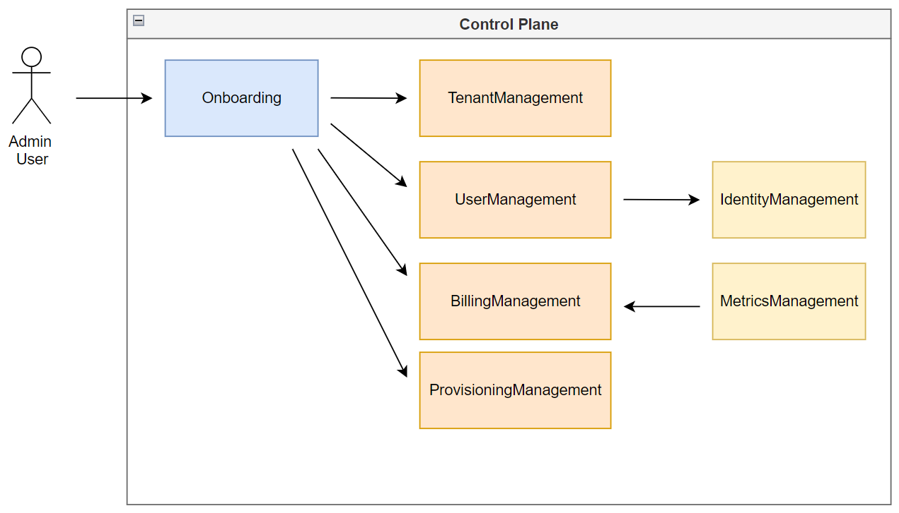

# Virtual SaaS Control Plane

This project simulates a SaaS control plane including each of it's services and the databases they use.

## What Is A SaaS Control Plane?

The control plane is foundational to any multi-tenant SaaS model. Every SaaS solution regardless of application deployment and isolation scheme must include these services to give you the ability to manage and operate your tenants with ease.

A control plane is the heart of a SaaS company, it handles everything from onboarding new users to sending bills. The control plane takes care of creating and managing tenants, provisioning infrastructure, gathering metrics and attributing them to tenants such that billing can be performed, as well as shutting down and removing resources when a tanant cancelles their contract. 

## Code Overview

In the [main.py](main.py) you will see some commands that reach out to the 'services' to perform various actions such as registering a new user/tenant, checking their billing/usage, checking the tenants tier (free/standard/premium), and finally deleting a tenant.

The files in the services folder would typically be their own services, be they lambdas or some other runtime. In this case I built this for learning purposes, and so each service is represented simply by a class that we instanciate and call to do thigns for us. In the real world we would be calling each of the services over REST API and each service would be it's own entity that scales and is updated and built at it's own pace. 

You will also see in several of the 'services' that I have 'fake database' and a list initialized at the top of the file. In the real world these would be external databases such as DynamoDB. 

Each of the services only knows as much as it needs to, the tenant_id is the first thing generated when a new user is registered. If a second user is registered with the same customer_name, the tenant_id of the first user will be recycled so they live under the same tenant. 

Once a tenant_id has been generated, we pass the user's email as well as their tenant_id over to the user management service which will create a user in the identity management service. The identity management service is mocked in this case, but would typically be something like Okta or Cognito. We pass the tenant_id into the identity management service such that it can be attached as a [claim](https://auth0.com/docs/secure/tokens/json-web-tokens/json-web-token-claims) to the user. The reason for this is, when the user logs into our SaaS application using the identity service, the tenant_id will be contained in their [JWT (Json Web Token)](https://jwt.io/) and our app can identify the tenant the user belongs to. This is useful because we want our app to log usage metrics against the tenant for billing purposes.

Next we create a billing entity, again attached to the tenant_id. The billing management service will check our metrics management service for metrics belonging to the tenant and bill according to the usage it finds. Usage being charged at some rate per use or per consumed resource.

Finally, we provision any infra that is needed, free tier users may share some pool of low grade resources, whereas premium may get a completely siloed deployment.

The tenant management service is the keeper of the tenants tier, but we should also remember that a free tier tenant may switch to being a paid tenant, and we should accord for any re-provisioning of resources that happen when a tenant changes tier.

## Architecture

The admin user talks to the onboarding management service, and the onboarding management service then orchistrates the onboarding and handles talking to all the other services:

## Project Layout

In the [main.py](./main.py) you will find the commands we are using to simulate interactions with the control plane services, it simulates an admin user inside the company.

In the services folder you will find a service that maps 1:1 with each of the services needed in a control plane.

| Services                                                          |
|-------------------------------------------------------------------|
| [Onboarding Management](./services/OnboardingManagement.py)       |
| [Tenant Management](./services/TenantManagement.py)               |
| [User Management](./services/UserManagement.py)                   |
| [Identity Management](./services/IdentityManagement.py)           |
| [Billing Management](./services/BillingManagement.py)             |
| [Provisioning Management](./services/ProvisioningManagement.py)   |
| [Metrics Management](./services/MetricsManagement.py)             |

## What Is The Purpose Of Each Service?

Onboarding – Every SaaS solution must provide a frictionless mechanism for introducing new
tenants into your SaaS environment. This can be a self-service sign-up page or an internally managed
experience. Either way, a SaaS solution should do all that it can remove internal and external friction
from this experience and ensure stability, efficiency, and repeatability for this process. It plays
an essential role in supporting the growth and scale of a SaaS business. Generally, this service
orchestrates other services to create users, tenant, isolation policies, provision, and per-tenant
resources.

Tenant – The tenant service provides a way to centralize the policies, attributes, and state of tenants.
The key is that tenants are not individual users. In fact, a tenant is likely associated with many users.

User – Adding users to the identity store, making sure they have the relevant claims like tenant_id.

Identity – SaaS systems need a clear way to connect users to tenants that will bring tenant context
to the authentication and authorization experience of their solutions. Identity is where the users will log in
typically this is handled by Okta or Cognito, but in this case I added a mock service for completeness.

Billing – As part of adopting SaaS, organizations often embrace new billing models. They may also
explore integration with third-party billing providers. This core service is largely focused on supporting
the onboarding of new tenants, and collecting consumption and activity data that is used to generate
bills for tenants.

Provisioning – This is the service that provisions any infra needed for a tenant, it could be databases, compute, or other resources.

Metrics – SaaS teams rely heavily on their ability to capture and analyze rich metric data that brings
more visibility to how tenants use their system, how they consume resources, and how their tenants
engage their systems. This data is used to shape operational, product, and business strategies.

## Closing Remarks

Hopefully someone finds this useful, there is no error handling, and there are no tests. This was assembled in a matter of hours on a Saturday night, so don't expect wonders.

## Further Reading

[SaaS WAF](https://docs.aws.amazon.com/whitepapers/latest/saas-architecture-fundamentals/saas-architecture-fundamentals.html)

